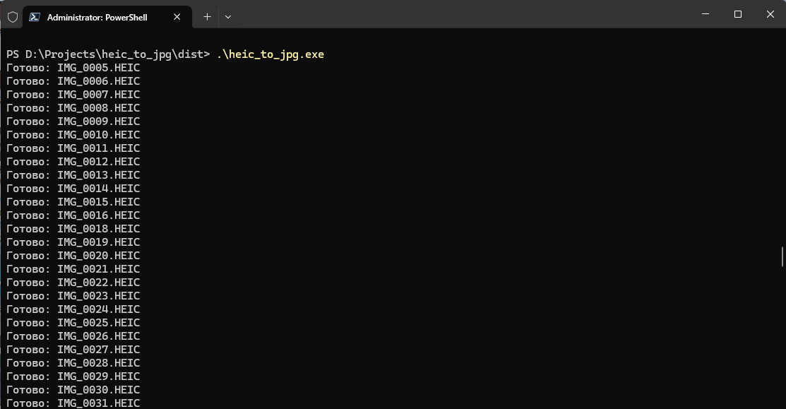

# heic_to_jpg

## Run

## Directory structure must be:

D:\Projects\heic_to_jpg\dist\
│
├── heic_to_jpg.exe
├── input_heic\
└── output_jpg\

### Execution

cd dist  
.\heic_to_jpg.exe

## Build

### Install Python

https://www.python.org/downloads/windows/

### Install dependencies

pip install pyinstaller  

python -m pip install pillow pillow-heif

### Rebuild EXE file

python -m PyInstaller --onefile --console --hidden-import=PIL --hidden-import=PIL.Image --hidden-import=pillow_heif heic_to_jpg.py
